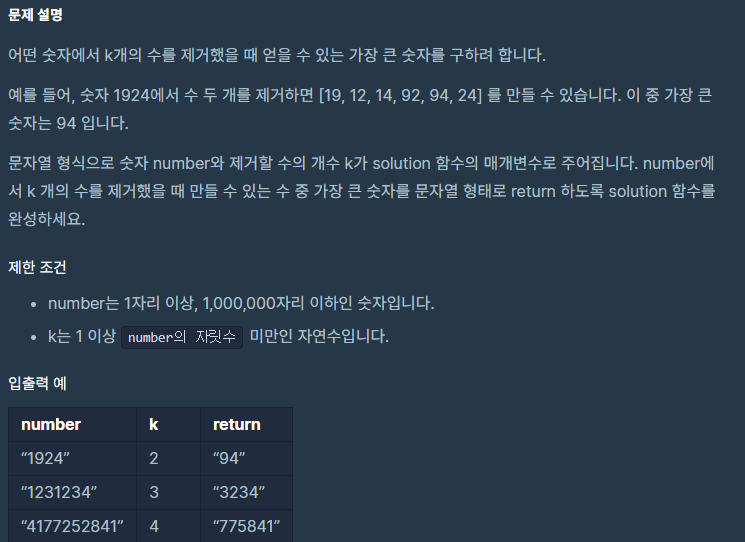

```python
def solution(number, k):
    result= []  
    for i, num in enumerate(number):
        while len(result) > 0 and result[-1] < num and k > 0:
            # print(result)
            result.pop()
            k -= 1
        if k == 0:
            result += list(number[i:])# 뒤에 남은거 가져다가 붙이기 
            break
        result.append(num)
    # print(result)
    # k가 남았을 경우 
    result = result[:-k] if k > 0 else result
    answer = ''.join(result)
    return answer
# print(solution('4177252841',4))           
```

맨 처음 아주 간단하게 각 인덱스별로 0과 1을 이용해 쓰는지 안쓰는지 조합을 돌려봤는데 

시간초과가 엄청 났다. 

그냥 dfs 시뮬레이션같은건 의식의 흐름 코드로 충분히 해결되는데 효율성 같은건 머리를 좀 써야되서 힘든것 같다. 

더 공부 해야할 부분을 또 찾았다.